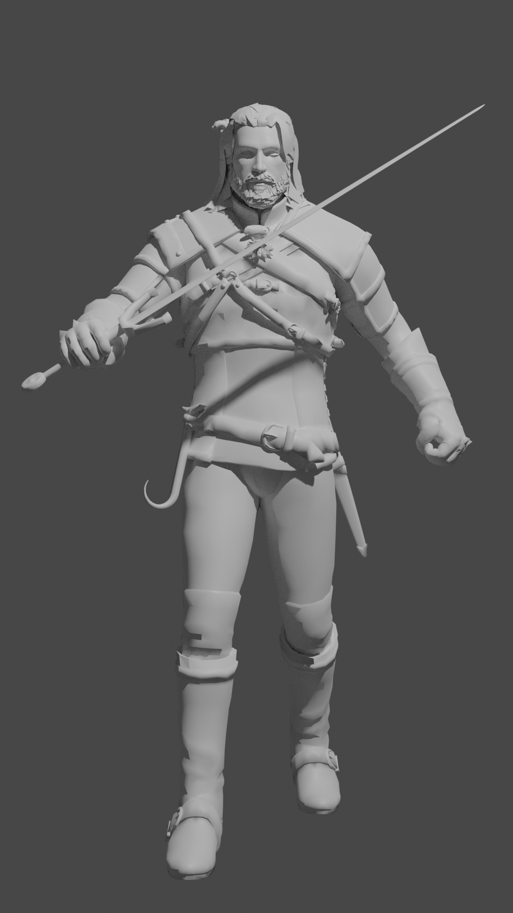
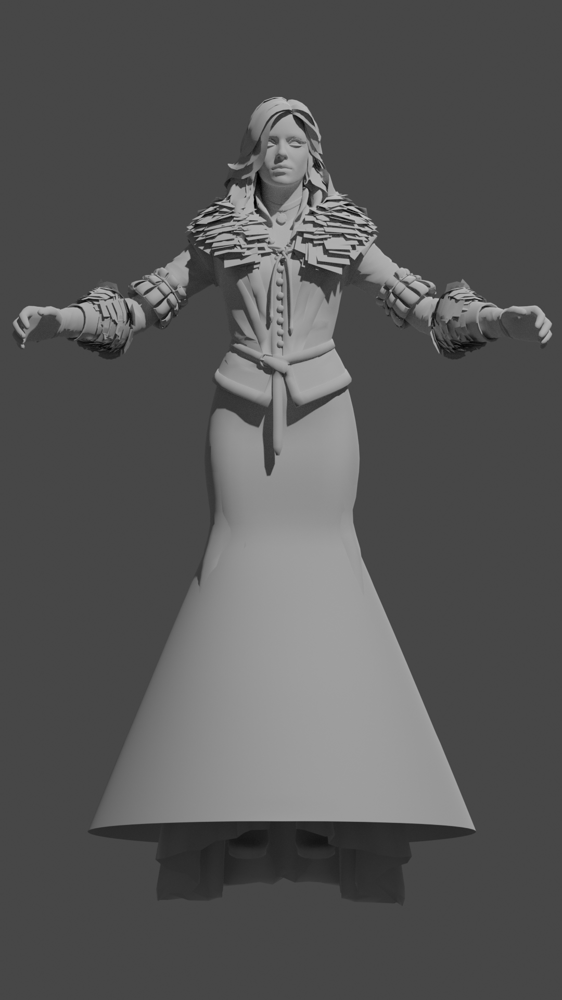

# Procedural and Neural Rendering

## 3D Models

1. [**Geralt of Rivia**](https://vedmak.fandom.com/wiki/%D0%93%D0%B5%D1%80%D0%B0%D0%BB%D1%8C%D1%82_%D0%B8%D0%B7_%D0%A0%D0%B8%D0%B2%D0%B8%D0%B8) - is a character in the computer game **"The Witcher 3: Wild Hunt"**. The 3D model was obtained from the [**Sketchfab**](https://sketchfab.com/3d-models/witcher-3-geralt-8f62c76580144ed2a8c648dd5046d8d9) Internet resource, where it was uploaded by the user [**biswayan**](https://sketchfab.com/3d-models/witcher-3-geralt-8f62c76580144ed2a8c648dd5046d8d9), and the model itself was created by the [**CD Project RED**](https://en.cdprojektred.com/) studio

2. [**Yennefer from Vengerberg**](https://vedmak.fandom.com/wiki/%D0%99%D0%B5%D0%BD%D0%BD%D0%B8%D1%84%D1%8D%D1%80_%D0%B8%D0%B7_%D0%92%D0%B5%D0%BD%D0%B3%D0%B5%D1%80%D0%B1%D0%B5%D1%80%D0%B3%D0%B) is a character in the computer game **"The Witcher 3: Wild Hunt"**. The 3D model was obtained from the Internet resource [**Pack 3d models**](https://p3dm.ru/files/characters/human/8913-yennefer-.html), where it was uploaded by user [**nerd666**](https://p3dm.ru/user/nerd666/), and the model itself was created by [**CD Project RED**](https://en.cdprojektred.com/)

## Model statistics

|№|Model|Vertices|Edges|Polygons|Triangles|Model format|
|---|---|---|---|---|---|---|
|1|[**Geralt**](Geralt.obj)|46 955|114 668|69 758|69 758|.obj|
|2|[**Yennefer**](Yennefer.obj)|33 088|85 373|52 235|52 235|.obj|